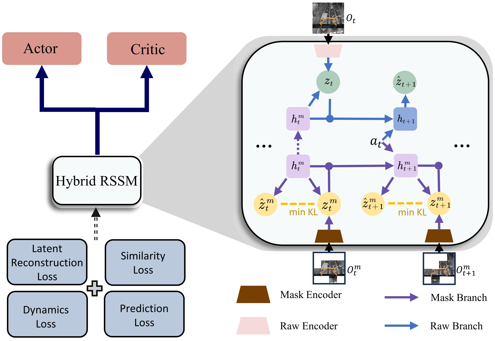

Code for the paper [Learning Latent Dynamic Robust Representations for World Models](https://icml.cc/virtual/2024/poster/34700) (ICML-24).

# HRSSM

We presented a new framework to learn state representations and dynamics in the presence of exogenous noise. We introduced the masking strategy and latent reconstruction to eliminate redundant spatio-temporal information, and employed bisimulation principle to capture task-relevant information. Addressing co-training instabilities, we further developed a hybrid RSSM (HRSSM) structure.



## Requirements

You can install the dependencies with the following command:

```bash
bash setup/install_env.sh
```

## Usage

To train the model in the paper, you can:

### DMC tasks with default settings

Run the following command:

```bash
python -u dreamer.py --configs dmc_vision  --task dmc_walker_stand --seed 0 --logdir ./log
```

### DMC tasks with distraction settings

Download the videos labeled 'driving_car' in the Kinetics 400 dataset and run the following command:

```bash
python -u dreamer.py --configs dmc_vision  --task dmc_walker_stand_video --seed 0 --logdir ./log
```

### DMC-GS

Run the following command, where {mode} is one of {color_easy, color_hard, video_easy, video_hard, sensor_cs, distracting_cs}:

```bash
python -u dreamer.py --configs dmc_vision  --task dmc_walker_stand_{mode} --seed 0 --logdir ./log
```

### Realistic Maniskill

Download the background assets from this [link](https://drive.google.com/file/d/1SLh1WOmYn5qzoDUygtlQ89SS8aBSenP0/view?usp=sharing) and run the following command:

```bash
python -u dreamer.py --configs realistic_maniskill --task rms_turn_faucet --seed 0 --logdir ./log
```


### 
## Acknowledgments

- our code is based on [dreamerv3-torch](https://github.com/NM512/dreamerv3-torch)
- the Distracted DeepMind Control Suite environment is adopted from [DBC](https://github.com/facebookresearch/deep_bisim4control)
- the Realistic Maniskill environment is adopted from [RePo](https://github.com/zchuning/repo)
- the DMC-GS environment is adopted from [DMControl Generalization Benchmark](https://github.com/nicklashansen/dmcontrol-generalization-benchmark/tree/main)

## References

Please cite the paper [Learning Latent Dynamic Robust Representations for World Models](https://icml.cc/virtual/2024/poster/34700) if you found the resources in the repository useful.